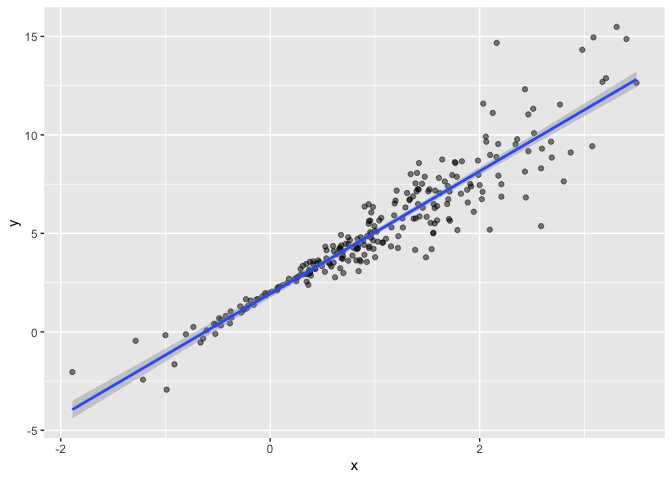
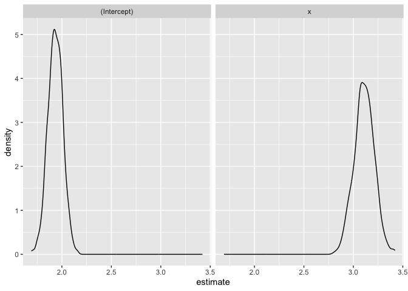
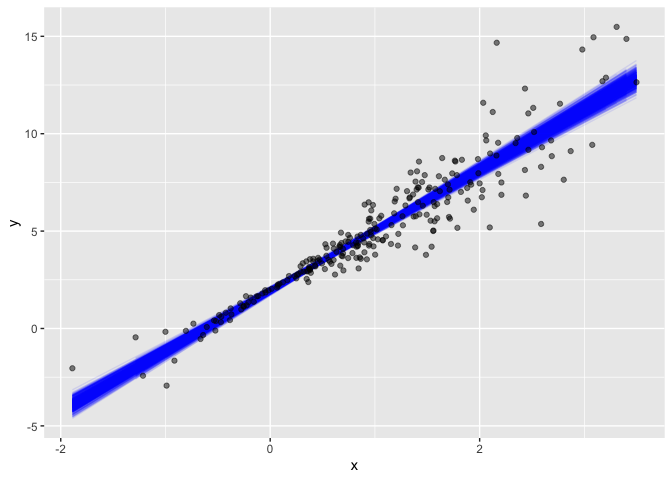
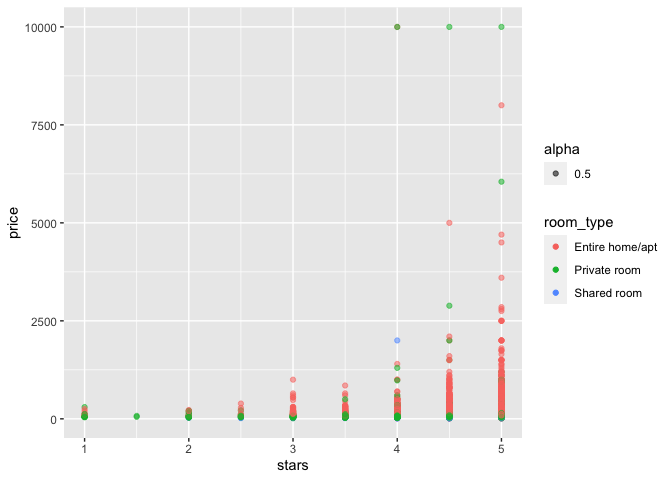
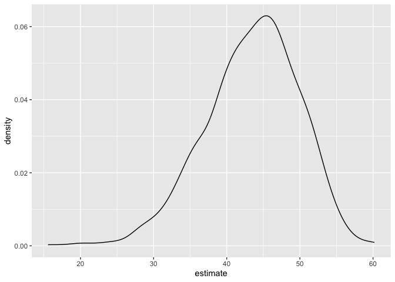
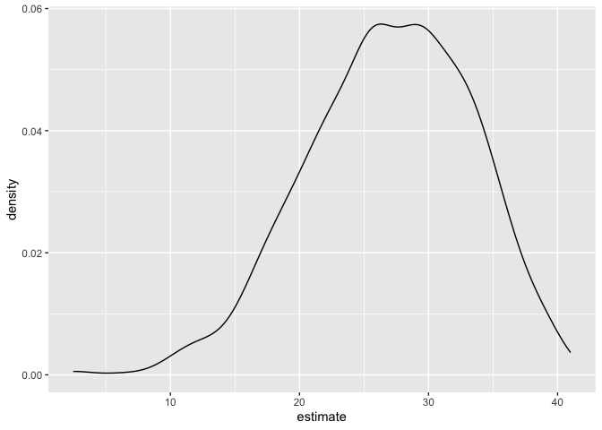

bootstrapping
================
Shihui Peng
2023-12-01

# generate a relevant example

``` r
n_samp = 250

# create a ds w constant variance
sim_df_const =
  tibble(
    x = rnorm(n_samp, 1, 1),
    error = rnorm(n_samp, 0, 1),
    y = 2 + 3 * x + error
  )

# create a ds w non-constant variance
sim_df_nonconst =
  sim_df_const |> 
  mutate(
    error = error * 0.75 * x,
    y = 2 + 3 * x + error
  )

sim_df_nonconst |> 
  ggplot(aes(x=x,y=y))+geom_point(alpha=.5) + stat_smooth(method="lm")
```

    ## `geom_smooth()` using formula = 'y ~ x'

<!-- -->

``` r
sim_df = 
  bind_rows(const = sim_df_const, nonconst = sim_df_nonconst, .id = "data_source")

sim_df |> 
  ggplot(aes(x = x, y = y)) + 
  geom_point(alpha = .5) +
  stat_smooth(method = "lm") +
  facet_grid(~data_source) 
```

    ## `geom_smooth()` using formula = 'y ~ x'

<!-- -->

# fit some linear models

``` r
sim_df_const |> 
  lm(y~x, data = _) |> 
  broom::tidy()
```

    ## # A tibble: 2 × 5
    ##   term        estimate std.error statistic   p.value
    ##   <chr>          <dbl>     <dbl>     <dbl>     <dbl>
    ## 1 (Intercept)     1.98    0.0981      20.2 3.65e- 54
    ## 2 x               3.04    0.0699      43.5 3.84e-118

``` r
sim_df_nonconst |> 
  lm(y~x, data = _) |> 
  broom::tidy()
```

    ## # A tibble: 2 × 5
    ##   term        estimate std.error statistic   p.value
    ##   <chr>          <dbl>     <dbl>     <dbl>     <dbl>
    ## 1 (Intercept)     1.93    0.105       18.5 1.88e- 48
    ## 2 x               3.11    0.0747      41.7 5.76e-114

- but we know that non-constant error ds does not meet linear reg
  assumptions, so we cannot trust the CI coming out from a linear reg
  model.

# draw and analyze a bootstrap sample

## start w a little function

``` r
boot_sample = function(df){
  sample_frac(df, replace = TRUE)
}
```

- `sample_frac()` know how to sample n rows from a table. the defaulted
  `sample_frac()` is sampling size 100% as large as the df
  - `replace = TRUE`: each sampled element is put back into the
    population before the next element is selected – the same element
    can be selected more than once in the sample.
  - if `replace = FALSE`: each sampled element is unique, meaning once
    an element is selected, it is not available for selection again. The
    next sampling is done from the remaining elements. This is the
    default behavior for sampling functions in R. — we do not want this
    here.

## let’s see how it works!

``` r
sim_df_nonconst |> 
  boot_sample() |> 
  ggplot(aes(x=x, y=y)) + geom_point(alpha = 0.5) + stat_smooth(method = "lm")
```

    ## `geom_smooth()` using formula = 'y ~ x'

<!-- --> \*
from the scatterplot, we can see some points are darker and some are
lighter. the darker ones means they are picked many times through the
`boot_sample function` we just defined

# draw a lot of samples and analyze them

## draw lots of samples

``` r
boot_straps = 
  tibble(strap_number = 1:1000) |> 
  mutate(
    strap_sample = map(strap_number, \(i) boot_sample(sim_df_nonconst))
  )

# check the 1st tibble of the output
boot_straps |> 
  pull(strap_sample) |> 
  nth(1) |> 
  arrange(x)
```

    ## # A tibble: 250 × 3
    ##         x   error       y
    ##     <dbl>   <dbl>   <dbl>
    ##  1 -1.89   1.62   -2.04  
    ##  2 -1.89   1.62   -2.04  
    ##  3 -1.21  -0.781  -2.43  
    ##  4 -1.21  -0.781  -2.43  
    ##  5 -1.00   0.832  -0.169 
    ##  6 -0.989 -1.97   -2.93  
    ##  7 -0.914 -0.908  -1.65  
    ##  8 -0.606 -0.106   0.0774
    ##  9 -0.536  0.0227  0.413 
    ## 10 -0.524 -0.536  -0.106 
    ## # ℹ 240 more rows

- `strap_sample = map(strap_number, \(i) boot_sample(sim_df_nonconst))`:
  `boot_sample()` does not really depend on `i`, this is just saying
  that for each iteration and strap_number, run exactly this line of
  code.

## now do the `lm` fit

``` r
boot_results = 
  boot_straps |> 
  mutate(
    models = map(strap_sample, \(df) lm(y~x, data = df)),
    results = map(models, broom::tidy)
  ) |> 
  select(strap_number, results) |> 
  unnest(results)
```

## try to summarise these results – get a bootstrap SE

``` r
boot_results |> 
  group_by(term) |> 
  summarise(
    se = sd(estimate)
  ) |> 
  knitr::kable()
```

| term        |        se |
|:------------|----------:|
| (Intercept) | 0.0747211 |
| x           | 0.1009731 |

## look at the distribution

``` r
boot_results |> 
  ggplot(aes(x = estimate)) + geom_density() + facet_grid(.~term)
```

<!-- -->

## can i construct a CI?

``` r
boot_results |> 
  group_by(term) |> 
  summarise(
    ci_lower = quantile(estimate, 0.025),
    ci_upper = quantile(estimate, 0.975)
  ) 
```

    ## # A tibble: 2 × 3
    ##   term        ci_lower ci_upper
    ##   <chr>          <dbl>    <dbl>
    ## 1 (Intercept)     1.79     2.08
    ## 2 x               2.91     3.31

- if you are in a case where you have the parameter estimate
  distribution doesn’t follow a normal distribution, and it is kind of
  skewed, then you might need more bootstrap samples to construct that
  CI – the \# of bootstrap does not really depend on sample size

## For a simple linear regression, show fitted lines for each bootstrap sample to build intuition for these results.

``` r
boot_straps |> 
  unnest(strap_sample) |> 
  ggplot(aes(x = x, y = y)) + 
  geom_line(aes(group = strap_number), stat = "smooth", method = "lm", se = FALSE, alpha = .1, color = "blue") +
  geom_point(data = sim_df_nonconst, alpha = .5)
```

    ## `geom_smooth()` using formula = 'y ~ x'

<!-- -->

## `bootstrap` function: draw bootstrap samples

Bootstrapping is common enough that it’s been automated, to some degree,
in the `modelr::boostrap` function. This function makes it easy to draw
bootstrap samples, and stores them in a mostly-helpful way – as a
resample object that can be converted to and treated like a data frame.
(This keeps you from having to actually store 1000 dataframes, and saves
a lot of memory on your computer.)

``` r
boot_straps_1 = 
  sim_df_nonconst |> 
  modelr::bootstrap(n = 1000)

# check one of the output df
boot_straps_1 |> pull(strap) |> nth(1) |> as_tibble()
```

    ## # A tibble: 250 × 3
    ##         x  error     y
    ##     <dbl>  <dbl> <dbl>
    ##  1  1.74   0.747  7.96
    ##  2  0.411  0.343  3.58
    ##  3  1.15  -1.12   4.34
    ##  4 -0.157 -0.159  1.37
    ##  5  2.21  -1.13   7.50
    ##  6  2.34   0.488  9.52
    ##  7  0.946 -0.498  4.34
    ##  8  1.21   1.55   7.17
    ##  9  2.52   0.528 10.1 
    ## 10  2.34   0.488  9.52
    ## # ℹ 240 more rows

``` r
# Let’s repeat our analysis pipeline using the bootstrap function instead of our own process for drawing samples with replacement.
sim_df_nonconst |> 
  modelr::bootstrap(n = 1000) |> 
  mutate(
    models = map(strap, \(df) lm(y ~ x, data = df) ),
    results = map(models, broom::tidy)) |> 
  select(-strap, -models) |> 
  unnest(results) |> 
  group_by(term) |> 
  summarize(boot_se = sd(estimate))
```

    ## # A tibble: 2 × 2
    ##   term        boot_se
    ##   <chr>         <dbl>
    ## 1 (Intercept)  0.0790
    ## 2 x            0.104

# Airbnb data

## impport data

``` r
data("nyc_airbnb")

nyc_airbnb = 
  nyc_airbnb |> 
  mutate(stars = review_scores_location / 2) |> 
  rename(
    borough = neighbourhood_group,
    neighborhood = neighbourhood) |> 
  filter(borough != "Staten Island") |> 
  drop_na(price, stars) |> 
  select(price, stars, borough, neighborhood, room_type)

nyc_airbnb |> 
  ggplot(aes(x = stars, y = price, color = room_type, alpha = 0.5)) + 
  geom_point() 
```

<!-- -->

## fit a regression of `price` on other variables and look at residuals

we are gonna fit a regression and look at the residual distribution and
figure out whether the model works well…

## model

``` r
airbnb_fit =
  nyc_airbnb |> 
  lm(price ~ stars+room_type+borough, data = _)
```

## residuals

``` r
nyc_airbnb |> 
  modelr::add_residuals(airbnb_fit) |> 
  ggplot(aes(y = resid, x = stars)) + geom_point()
```

<!-- --> \* we
can see the residuals are skewed. so this model works not really well.
soif someone give me a CI based on this, i might not take it.

## so, we can run a bootstrap on this whole thing for the effect of `stars` on `price`

``` r
Manhattan_df =
  nyc_airbnb |> 
  filter(borough == "Manhattan")

boot_results =
  tibble(strap_number = 1:1000) |> 
  mutate(
    strap_sample = map(strap_number, \(i) boot_sample(Manhattan_df)),
    models = map(strap_sample, \(df) lm(price~stars, data = df)),
    results = map(models, broom::tidy)
  ) |> 
  select(strap_number, results) |> 
  unnest(results)

# remember that boot_sample is the function i created before for creating samples

boot_results |> 
  filter(term == "stars") |> 
  ggplot(aes(x = estimate)) + geom_density()
```

<!-- --> \* we
can see the distribution of estimate is left-skewed. Conceptually the
reason that this is happening – there are big outliers in this dataset.
Take a look at the graph in chunk 13. \* so, we get the distribution of
price, overall it is a more accurate reflection of the distribution of
these regression coefficients in the pop. This is not the one that we
can get just from a linear model

another way using `modelr::bootstrap`

``` r
nyc_airbnb |> 
  filter(borough == "Manhattan") |> 
  modelr::bootstrap(n = 1000) |> 
  mutate(
    models = map(strap, \(df) lm(price ~ stars + room_type, data = df)),
    results = map(models, broom::tidy)) |> 
  select(results) |> 
  unnest(results) |> 
  filter(term == "stars") |> 
  ggplot(aes(x = estimate)) + geom_density()
```

<!-- -->
