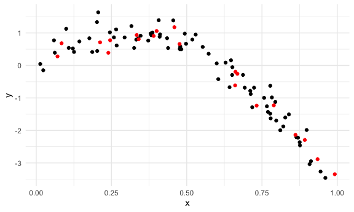
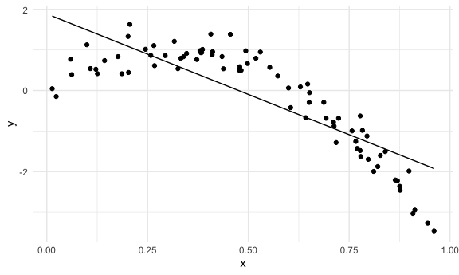
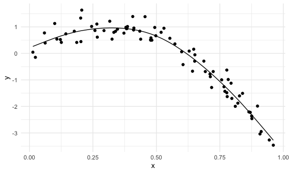
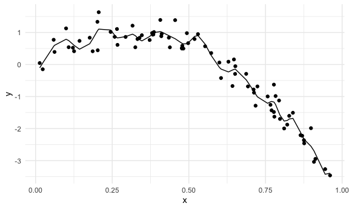
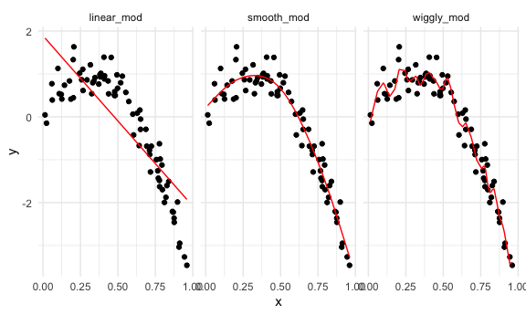
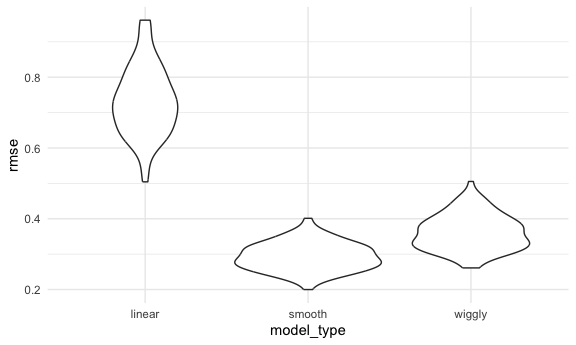
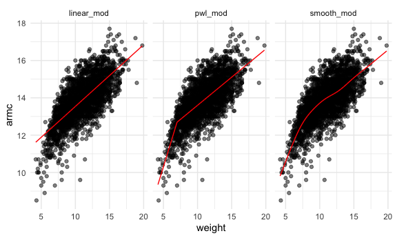
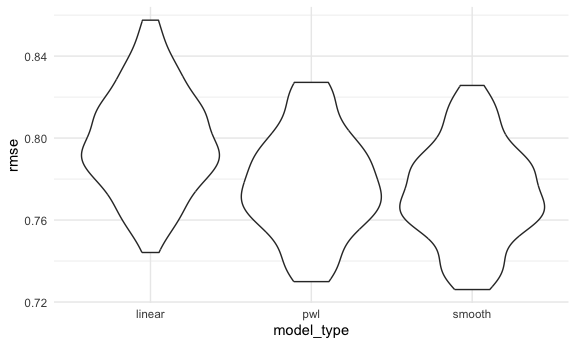

cross_validation
================
Shihui Peng
2023-11-29

# nonlinear data and cross validation

## first create a nonlinear dataset

``` r
nonlin_df =
  tibble(
    id = 1:100,
    x = runif(100, 0, 1),
    y = 1 - 10 * (x - 0.3) ^2 + rnorm(100, 0, 0.3)
  )

nonlin_df |> 
  ggplot(aes(x = x, y = y)) + geom_point()
```


then we are trying to pick b/t a few diff models that might work for
this dataset. we are gonna see which of those models has the best
prediction accuracy.

## do the train / test split

### one: by hand

#### create the train set and test set

``` r
train_df = sample_n(nonlin_df, 80) |> arrange(id)
test_df = anti_join(nonlin_df, train_df, by = "id")

# we can check in a scatterplot:
train_df |> 
  ggplot(aes(x = x, y = y)) +
  geom_point() +
  geom_point(data = test_df, color = "red")
```


\* our question: \* can i fit some curves through the black points here
and then see how well that curve predicts the red points here. \* it is
not gonna give me perfect predictions, as there’s gonna be residual
error b/c there’s some noise floating around in here. but we can choose
the best curve with smallest noise.

#### fit a linear model

``` r
linear_mod = lm(y ~ x, data = train_df)

smooth_mod = mgcv::gam(y ~ s(x), data = train_df)

wiggly_mod = mgcv::gam(y ~ s(x, k = 30), sp = 10e-6, data = train_df)

# quick visualization
train_df |> 
  modelr::add_predictions(linear_mod) |> 
  ggplot(aes(x=x,y=y)) + geom_point() + geom_line(aes(y = pred))
```



``` r
train_df |> 
  modelr::add_predictions(smooth_mod) |> 
  ggplot(aes(x=x,y=y)) + geom_point() + geom_line(aes(y = pred))
```



``` r
train_df |> 
  modelr::add_predictions(wiggly_mod) |> 
  ggplot(aes(x=x,y=y)) + geom_point() + geom_line(aes(y = pred))
```



``` r
# I can also use the handy modelr::gather_predictions function – this is, essentially, a short way of adding predictions for several models to a data frame and then “pivoting” so the result is a tidy, “long” dataset that’s easily plottable.

train_df |> 
  gather_predictions(linear_mod, smooth_mod, wiggly_mod) |> 
  mutate(model = fct_inorder(model)) |> 
  ggplot(aes(x = x, y = y)) + 
  geom_point() + 
  geom_line(aes(y = pred), color = "red") + 
  facet_wrap(~model)
```


\* `s(x)`: smooth term of x \* no need to specify to use quadralic or
cubic or sth, r will determine internally how smooth is smooth ehough.
\* `mgcv` package can fit generalized additive models \* `k = 30`: i
will get 30 individual line segments \* `sp = 10e-6`: mgcv will try to
stop us from doing sth dumb, but this is like forcing us to do sth dumb.
\* `modelr::gather_predictions` function \* a short way of adding
predictions for several models to a data frame and then “pivoting” so
the result is a tidy, “long” dataset that’s easily plottable. \* A quick
visual inspection suggests that the linear model is too simple, the
standard gam fit is pretty good, and the wiggly gam fit is too complex.
Put differently, the linear model is too simple and, no matter what
training data we use, will never capture the true relationship between
variables – it will be consistently wrong due to its simplicity, and is
therefore biased. The wiggly fit, on the other hand, is chasing data
points and will change a lot from one training dataset to the the next –
it will be consistently wrong due to its complexity, and is therefore
highly variable. Both are bad!

#### calculate root mean squared error for unnested models to compare

- I want to know which of these model is the one that i want to use for
  implementing an analysis - but they are not nested, so i cannot use
  AIC or BIC. I have to use other methods.
  - we can use root mean squared error:

``` r
# in modelr package

# RMSEs on training data can be misleading...
rmse(linear_mod, train_df)
```

    ## [1] 0.7178747

``` r
rmse(smooth_mod, train_df)
```

    ## [1] 0.2874834

``` r
rmse(wiggly_mod, train_df)
```

    ## [1] 0.2498309

``` r
# RMSEs on testing data gives a sense of out-of-sample prediction accuracy!
rmse(linear_mod, test_df)
```

    ## [1] 0.7052956

``` r
rmse(smooth_mod, test_df)
```

    ## [1] 0.2221774

``` r
rmse(wiggly_mod, test_df)
```

    ## [1] 0.289051

- The modelr has other outcome measures – RMSE is the most common, but
  median absolute deviation is pretty common as well.
- we can see the the wiggly_mod has the lowest root mean squared error
  in train set, but smooth_mod has the lowest rmse in test set
  - problem: it works on this ds and gives us the best predictions for
    this ds that we use to train the model. but it probably won’t give
    us the best predictions on some future dataset.
  - The RMSEs are suggestive that both nonlinear models work better than
    the linear model, and that the smooth fit is worse than the wiggly
    fit. However, to get a sense of model stability we really need to
    iterate this whole process. Of course, this could be done using
    loops but that’s a hassle …

### use modelr for CV

#### `crossv_mc()`, and resample, and convert resample to tibble

``` r
cv_df =
  nonlin_df |> 
  crossv_mc(n = 100)
```

- `crossv_mc`: generate test-training pairs for cross validation test
  - `n = 100` indicates the number of folds or iterations for the
    cross-validation.

however, the created train and test set is not a tibble, but a resample.

``` r
cv_df |> pull(train) |> nth(1)
```

    ## <resample [79 x 3]> 1, 2, 3, 4, 6, 7, 8, 9, 10, 11, ...

``` r
cv_df |> pull(train) |> nth(2)
```

    ## <resample [79 x 3]> 1, 2, 3, 4, 5, 6, 7, 8, 9, 10, ...

``` r
# it just saves the row numbers
```

- what `resample` does is keep track of which rows are in this sample,
  rather than storing the dataset over and over again.
  - rather than repeating the dataset a bunch of times, it saves the
    data once and stores the indexes for each training / testing split
    using a resample object.

we can convert a resample object to a data frame using `as_tibble()`

``` r
cv_df |> pull(train) |> nth(3) |> as_tibble()
```

    ## # A tibble: 79 × 3
    ##       id     x      y
    ##    <int> <dbl>  <dbl>
    ##  1     1 0.266  1.11 
    ##  2     2 0.372  0.764
    ##  3     3 0.573  0.358
    ##  4     4 0.908 -3.04 
    ##  5     5 0.202  1.33 
    ##  6     6 0.898 -1.99 
    ##  7     7 0.945 -3.27 
    ##  8    11 0.206  1.63 
    ##  9    12 0.177  0.836
    ## 10    13 0.687 -0.291
    ## # ℹ 69 more rows

therefore…we convert a resample object to a tibble object, and then we
can have dataframes for analysis

``` r
cv_df =
  nonlin_df |> 
  crossv_mc(n = 100) |> 
  mutate(
    train = map(train, as_tibble),
    test = map(test, as_tibble)
  )
```

#### apply each model to all training ds, and evaluate on all testing ds

now, i want to fit a linear model to all of my training ds and compute
root mean squared errors on all my testing ds. Then I want to do this
again for a smooth model and again for a wiggly model.

- this can give me a sense of how much of that diff in prediction
  accuracy is attributable to (like one model actually better than
  another), and how much of it is arrtibutable to the randomness.

``` r
cv_results =
  cv_df |> 
  mutate(
    linear_fit = map(train, \(df) lm(y~x, data = df)),
    smooth_fit = map(train, \(df) mgcv::gam(y~s(x), data = df)),
    wiggly_fit = map(train, \(df) mgcv::gam(y~s(x, k = 30), sp = 10e-6, data = df))
  ) |> 
  mutate(
    rmse_linear = map2_dbl(linear_fit, test, \(mod, df) rmse(mod, df)),
    rmse_smooth = map2_dbl(smooth_fit, test, \(mod, df) rmse(mod, df)),
    rmse_wiggly = map2_dbl(wiggly_fit, test, \(mod, df) rmse(mod, df))
  )
```

- `\(df) lm(y~x, data = df)` is the shorthand of this:
  `lin_mod_function = function(df){lm(y~x, data = df)}`
- here, `y` and `x` are not arguments.
  - inside train ds, there are y col and x col. so here this means treat
    the y col as y and x col as x in a linear reg.
- `map2()`: iterate over 2 arguments / inputs at a time
- `map2_dbl()`: return a double vector. use it when you know that your
  output will be exactly 1 number.

``` r
cv_results |> 
  select(starts_with("rmse")) |> 
  pivot_longer(
    everything(),
    names_to = "model_type",
    values_to = "rmse",
    names_prefix = "rmse_"
  ) |> 
  group_by(model_type) |> 
  summarise(m_rmse = mean(rmse))
```

    ## # A tibble: 3 × 2
    ##   model_type m_rmse
    ##   <chr>       <dbl>
    ## 1 linear      0.733
    ## 2 smooth      0.293
    ## 3 wiggly      0.362

``` r
cv_results |> 
  select(starts_with("rmse")) |> 
  pivot_longer(
    everything(),
    names_to = "model_type",
    values_to = "rmse",
    names_prefix = "rmse_"
  ) |> 
  ggplot(aes(x = model_type, y = rmse)) + geom_violin()
```



- Repeating the split is helpful
  - now we get a sense of variance in prediction error and can compare
    prediction error distributions across methods. The **smooth fit** is
    a clear winner! (even though wiggly stuff overlap smooth stuff
    sometimes)
- It’s worth remembering, though, that this isn’t testing a null
  hypothesis and there aren’t p-values as a result.

# example: child growth

## import dataset

``` r
child_growth = read_csv("data/nepalese_children.csv")
```

    ## Rows: 2705 Columns: 5
    ## ── Column specification ────────────────────────────────────────────────────────
    ## Delimiter: ","
    ## dbl (5): age, sex, weight, height, armc
    ## 
    ## ℹ Use `spec()` to retrieve the full column specification for this data.
    ## ℹ Specify the column types or set `show_col_types = FALSE` to quiet this message.

## visualization:

``` r
child_growth |> 
  ggplot(aes(x = weight, y = armc)) + geom_point(alpha=0.5)
```


\* The plots suggests some non-linearity, especially at the low end of
the weight distribution. \* We’ll try three models: a linear fit; a
piecewise linear fit; and a smooth fit using gam. \* For the piecewise
linear fit, we need to add a “change point term” to our dataframe. (Like
additive models, for now it’s not critical that you understand
everything about a piecewise linear fit – we’ll see a plot of the
results soon, and the intuition from that is enough for our purposes.)

## question: do we need to take into account any kind of non-linearity in this data set, if we want to regress armc on weight or other variables?

create a piecewise linear fit

``` r
child_growth =
  child_growth |> 
  mutate(weight_cp = (weight > 7) * (weight - 7))
```

fits each of the candidate models to the full dataset.

``` r
linear_mod = lm(armc ~ weight, data = child_growth)
pwl_mod    = lm(armc ~ weight + weight_cp, data = child_growth)
smooth_mod = mgcv::gam(armc ~ s(weight), data = child_growth)
```

- The piecewise linear model is nested in the linear model and could be
  assessed using statistical significance, but the smooth model is not
  nested in anything else. (Also, comparing a piecewise model with a
  changepoint at 7 to a piecewise model with a changepoint at 8 would be
  a non-nested comparison…)

As before, I’ll plot the three models to get intuition for goodness of
fit…

``` r
child_growth |> 
  gather_predictions(linear_mod, pwl_mod, smooth_mod) |> 
  ggplot(aes(x = weight, y = armc)) + geom_point(alpha=.5) + geom_line(aes(y = pred), color = "red") + 
  facet_wrap(~model)
```



- It’s not clear which is best – the linear model is maybe too simple,
  but the piecewise and non-linear models are pretty similar! Better
  check prediction errors using the same process as before – again,
  since I want to fit a gam model, I have to convert the resample
  objects produced by crossv_mc to dataframes, but wouldn’t have to do
  this if I only wanted to compare the linear and piecewise models.

``` r
cv_df = 
  crossv_mc(child_growth, n = 100) |> 
  mutate(
    train = map(train, as_tibble),
    test = map(test, as_tibble)
  )
```

Next I’ll use mutate + map & map2 to fit models to training data and
obtain corresponding RMSEs for the testing data.

``` r
cv_df =
  cv_df |> 
  mutate(
    linear_mod = map(train, \(df) lm(armc~weight, data = df)),
    pwl_mod = map(train, \(df) lm(armc~weight + weight_cp, data = df)),
    smooth_mod = map(train, \(df) mgcv::gam(armc~s(weight), data = df))
  ) |> 
  mutate(
    rmse_linear = map2_dbl(linear_mod, test, \(mod, df) rmse(mod, df)),
    rmse_pwl = map2_dbl(pwl_mod, test, \(mod, df) rmse(mod, df)),
    rmse_smooth = map2_dbl(smooth_mod, test, \(mod, df) rmse(mod, df))
  )
```

Finally, I’ll plot the prediction error distribution for each candidate
model.

``` r
cv_df |> 
  select(starts_with("rmse")) |> 
  pivot_longer(
    everything(),
    names_to = "model_type",
    values_to = "rmse",
    names_prefix = "rmse_"
  ) |> 
  ggplot(aes(x = model_type, y = rmse)) + geom_violin()
```



- Based on these results, there’s clearly some improvement in predictive
  accuracy gained by allowing non-linearity – whether this is sufficient
  to justify a more complex model isn’t obvious, though. Among the
  non-linear models, the smooth fit from gam might be a bit better than
  the piecewise linear model. Which candidate model is best, though,
  depends a bit on the need to balance complexity with goodness of fit
  and interpretability.  
- In the end, I’d probably go with the piecewise linear model – the
  non-linearity is clear enough that it should be accounted for, and the
  differences between the piecewise and gam fits are small enough that
  the easy interpretation of the piecewise model “wins”.
- <https://drsimonj.svbtle.com/k-fold-cross-validation-with-modelr-and-broom>
  : This post has a pretty detailed analysis of K fold CV.
