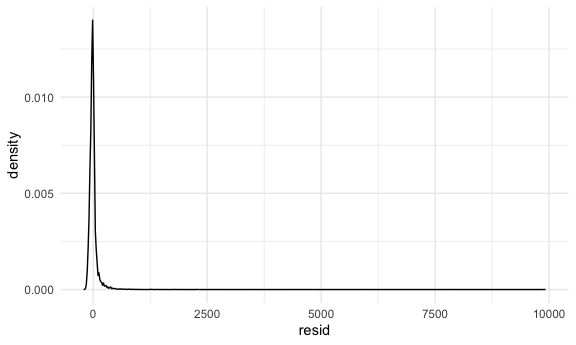
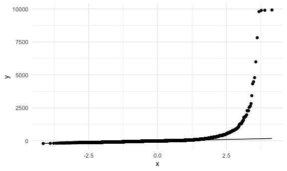
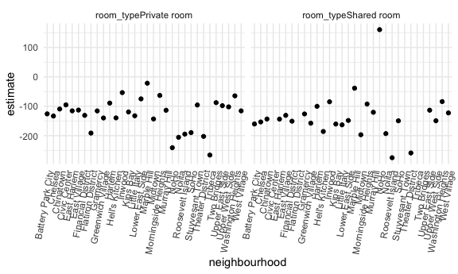

linear models
================
Shihui Peng
2023-11-24

## load and clean the Airbnb data

``` r
data("nyc_airbnb")

nyc_airbnb = 
  nyc_airbnb |> 
  mutate(stars = review_scores_location / 2) |> 
  select(price, stars, borough = neighbourhood_group, neighbourhood, room_type) |> 
    filter(borough != "Staten Island")
```

# let’s fit a model

## fit a model

``` r
fit = lm(price ~ stars + borough, data = nyc_airbnb)

# or we can use this:
fit =
  nyc_airbnb |> 
  lm(price ~ stars + borough, data = _)

# let's look at the 'fit'
fit
```

    ## 
    ## Call:
    ## lm(formula = price ~ stars + borough, data = nyc_airbnb)
    ## 
    ## Coefficients:
    ##      (Intercept)             stars   boroughBrooklyn  boroughManhattan  
    ##           -70.41             31.99             40.50             90.25  
    ##    boroughQueens  
    ##            13.21

- no need to create dummy variables by ourselves, r will recognize the
  categorical variables and create for us.
- The `lm` function begins with the formula specification – outcome on
  the left of the ~ and predictors separated by + on the right.
  - interactions between variables can be specified using `*`.
  - You can also specify an intercept-only model (`outcome ~ 1`)
  - a model with no intercept (`outcome ~ 0 + ...`) (default is with
    intercept)
  - a model using all available predictors (`outcome ~ .`).

## we can use these common functions, but usually we don’t

``` r
summary(fit)
```

    ## 
    ## Call:
    ## lm(formula = price ~ stars + borough, data = nyc_airbnb)
    ## 
    ## Residuals:
    ##    Min     1Q Median     3Q    Max 
    ## -169.8  -64.0  -29.0   20.2 9870.0 
    ## 
    ## Coefficients:
    ##                  Estimate Std. Error t value Pr(>|t|)    
    ## (Intercept)       -70.414     14.021  -5.022 5.14e-07 ***
    ## stars              31.990      2.527  12.657  < 2e-16 ***
    ## boroughBrooklyn    40.500      8.559   4.732 2.23e-06 ***
    ## boroughManhattan   90.254      8.567  10.534  < 2e-16 ***
    ## boroughQueens      13.206      9.065   1.457    0.145    
    ## ---
    ## Signif. codes:  0 '***' 0.001 '**' 0.01 '*' 0.05 '.' 0.1 ' ' 1
    ## 
    ## Residual standard error: 181.5 on 30525 degrees of freedom
    ##   (9962 observations deleted due to missingness)
    ## Multiple R-squared:  0.03423,    Adjusted R-squared:  0.03411 
    ## F-statistic: 270.5 on 4 and 30525 DF,  p-value: < 2.2e-16

``` r
summary(fit)$coef
```

    ##                   Estimate Std. Error   t value     Pr(>|t|)
    ## (Intercept)      -70.41446  14.020697 -5.022180 5.137589e-07
    ## stars             31.98989   2.527500 12.656733 1.269392e-36
    ## boroughBrooklyn   40.50030   8.558724  4.732049 2.232595e-06
    ## boroughManhattan  90.25393   8.567490 10.534465 6.638618e-26
    ## boroughQueens     13.20617   9.064879  1.456850 1.451682e-01

``` r
coef(fit)
```

    ##      (Intercept)            stars  boroughBrooklyn boroughManhattan 
    ##        -70.41446         31.98989         40.50030         90.25393 
    ##    boroughQueens 
    ##         13.20617

``` r
# fitted.values(fit) --> pull out the fitted values
```

- The reason that we omit the output
  - it’s a huge pain to deal with. `summary` produces an object of class
    `summary.lm`, which is also a list – that’s how we extracted the
    coefficients using `summary(fit)$coef`. `coef` produces a vector of
    coefficient values, and `fitted.values` is a vector of fitted
    values. None of this is tidy.

## instead, we want tidy up the output (`broom::glance()`) and tidy up the coefficients (`broom::tidy()`):

``` r
fit |> 
  broom::glance()
```

    ## # A tibble: 1 × 12
    ##   r.squared adj.r.squared sigma statistic   p.value    df   logLik    AIC    BIC
    ##       <dbl>         <dbl> <dbl>     <dbl>     <dbl> <dbl>    <dbl>  <dbl>  <dbl>
    ## 1    0.0342        0.0341  182.      271. 6.73e-229     4 -202113. 4.04e5 4.04e5
    ## # ℹ 3 more variables: deviance <dbl>, df.residual <int>, nobs <int>

``` r
fit |> 
  broom::tidy()
```

    ## # A tibble: 5 × 5
    ##   term             estimate std.error statistic  p.value
    ##   <chr>               <dbl>     <dbl>     <dbl>    <dbl>
    ## 1 (Intercept)         -70.4     14.0      -5.02 5.14e- 7
    ## 2 stars                32.0      2.53     12.7  1.27e-36
    ## 3 boroughBrooklyn      40.5      8.56      4.73 2.23e- 6
    ## 4 boroughManhattan     90.3      8.57     10.5  6.64e-26
    ## 5 boroughQueens        13.2      9.06      1.46 1.45e- 1

``` r
# broom::tidy() outputs a table but this outputs a matrix (found based on...)
summary(fit)$coef |> class()
```

    ## [1] "matrix" "array"

- `broom::tidy()` outputs a table vs `summary(fit)$coef` outputs a
  matrix. so broom::tidy() is better b/c a table is easier to be used.

### why we say a table is better… e.g.:

``` r
fit |> 
  broom::tidy() |> 
  mutate(
    term = str_replace(term, "^borough", "Borough: ")
  ) |> 
  select(term, estimate, p.value) |> 
  knitr::kable(digits = 3)
```

| term               | estimate | p.value |
|:-------------------|---------:|--------:|
| (Intercept)        |  -70.414 |   0.000 |
| stars              |   31.990 |   0.000 |
| Borough: Brooklyn  |   40.500 |   0.000 |
| Borough: Manhattan |   90.254 |   0.000 |
| Borough: Queens    |   13.206 |   0.145 |

- a good thing is everything after b::t is familiar tidyverse codes.
- As an aside, broom::tidy works with lots of things, including most of
  the functions for model fitting you’re likely to run into (survival,
  mixed models, additive models, …).

### when r creating indicator variables for categorical vars:

``` r
fit_1 = 
  nyc_airbnb |> 
  mutate(
    borough = fct_infreq(borough),
    room_type = fct_infreq(room_type)
  ) |> 
  lm(price ~ stars + borough, data = _)

fit_1 |> 
  broom::tidy()
```

    ## # A tibble: 5 × 5
    ##   term            estimate std.error statistic   p.value
    ##   <chr>              <dbl>     <dbl>     <dbl>     <dbl>
    ## 1 (Intercept)         19.8     12.2       1.63 1.04e-  1
    ## 2 stars               32.0      2.53     12.7  1.27e- 36
    ## 3 boroughBrooklyn    -49.8      2.23    -22.3  6.32e-109
    ## 4 boroughQueens      -77.0      3.73    -20.7  2.58e- 94
    ## 5 boroughBronx       -90.3      8.57    -10.5  6.64e- 26

- it takes whatever cat var I has started with (e.g. stars before
  borough here)
- it assumes the same factor order as ggplot does (which is,
  alphabetical order). but we can mutate it if we need. as below:

### let’s fit another model

``` r
fit = lm(price ~ stars + borough + room_type, data = nyc_airbnb)

fit |> 
  broom::tidy()
```

    ## # A tibble: 7 × 5
    ##   term                  estimate std.error statistic  p.value
    ##   <chr>                    <dbl>     <dbl>     <dbl>    <dbl>
    ## 1 (Intercept)              49.5      13.6      3.64  2.76e- 4
    ## 2 stars                    21.9       2.43     9.01  2.09e-19
    ## 3 boroughBrooklyn          22.7       8.20     2.77  5.60e- 3
    ## 4 boroughManhattan         63.0       8.22     7.67  1.76e-14
    ## 5 boroughQueens             7.58      8.68     0.873 3.82e- 1
    ## 6 room_typePrivate room  -105.        2.05   -51.2   0       
    ## 7 room_typeShared room   -129.        6.15   -21.0   2.24e-97

# general model diagnotics with `mdoelr` package

Regression diagnostics can identify issues in model fit, especially
related to certain failures in model assumptions. Examining residuals
and fitted values are therefore an imporant component of any modeling
exercise.

## draw some plots related to residuals

``` r
nyc_airbnb |> 
  modelr::add_residuals(fit) |> 
  ggplot(aes(x = resid)) +
  geom_density()
```

    ## Warning: Removed 9962 rows containing non-finite values (`stat_density()`).



``` r
nyc_airbnb |> 
  modelr::add_residuals(fit) |> 
  ggplot(aes(x = borough, y = resid)) +
  geom_violin()
```

    ## Warning: Removed 9962 rows containing non-finite values (`stat_ydensity()`).



``` r
nyc_airbnb |> 
  modelr::add_residuals(fit) |> 
  ggplot(aes(x = stars, y = resid)) +
  geom_point()
```

    ## Warning: Removed 9962 rows containing missing values (`geom_point()`).


\* This example has some obvious issues, most notably the presence of
extremely large outliers in price and a generally skewed residual
distribution. \* There are a few things we might try to do here –
including: \* creating a formal rule for the exclusion of outliers \*
transforming the price variable (e.g. using a log transformation) \*
fitting a model that is robust to outliers. \* (For what it’s worth, I’d
probably use a combination of median regression, which is less sensitive
to outliers than OLS, and maybe bootstrapping for inference. If that’s
not feasible, I’d omit rentals with price over \$1000 (\< 0.5% of the
sample) from the primary analysis and examine these separately. I
usually avoid transforming the outcome, because the results model is
difficult to interpret.)

### get prediction values

the modelr package can also provide us prediction values

``` r
modelr::add_predictions(nyc_airbnb, fit)
```

    ## # A tibble: 40,492 × 6
    ##    price stars borough neighbourhood room_type        pred
    ##    <dbl> <dbl> <chr>   <chr>         <chr>           <dbl>
    ##  1    99   5   Bronx   City Island   Private room     54.0
    ##  2   200  NA   Bronx   City Island   Private room     NA  
    ##  3   300  NA   Bronx   City Island   Entire home/apt  NA  
    ##  4   125   5   Bronx   City Island   Entire home/apt 159. 
    ##  5    69   5   Bronx   City Island   Private room     54.0
    ##  6   125   5   Bronx   City Island   Entire home/apt 159. 
    ##  7    85   5   Bronx   City Island   Entire home/apt 159. 
    ##  8    39   4.5 Bronx   Allerton      Private room     43.1
    ##  9    95   5   Bronx   Allerton      Entire home/apt 159. 
    ## 10   125   4.5 Bronx   Allerton      Entire home/apt 148. 
    ## # ℹ 40,482 more rows

# hypothesis test for categorical predictor

fit a ‘null’ and ‘alternative’ model - doing a test for nested models

``` r
fit_null = lm(price ~ stars + borough, data = nyc_airbnb)
fit_alt = lm(price ~ stars + borough + room_type, data = nyc_airbnb)

anova(fit_null, fit_alt) |> 
  broom::tidy()
```

    ## # A tibble: 2 × 7
    ##   term                        df.residual    rss    df   sumsq statistic p.value
    ##   <chr>                             <dbl>  <dbl> <dbl>   <dbl>     <dbl>   <dbl>
    ## 1 price ~ stars + borough           30525 1.01e9    NA NA            NA       NA
    ## 2 price ~ stars + borough + …       30523 9.21e8     2  8.42e7     1394.       0

this is kinda a partial F test.

# borough-level differences

if we try to understand what effect each of these variables has and does
it differ by borough…

## if we put directly add interaction terms..

``` r
fit =
  nyc_airbnb |> 
  lm(price ~ stars*borough + room_type*borough, data = _)

fit |> 
  broom::tidy()
```

    ## # A tibble: 16 × 5
    ##    term                                   estimate std.error statistic   p.value
    ##    <chr>                                     <dbl>     <dbl>     <dbl>     <dbl>
    ##  1 (Intercept)                               90.1       75.4    1.19   0.232    
    ##  2 stars                                      4.45      16.6    0.267  0.789    
    ##  3 boroughBrooklyn                          -20.4       77.1   -0.265  0.791    
    ##  4 boroughManhattan                           5.63      77.8    0.0723 0.942    
    ##  5 boroughQueens                              1.51      83.5    0.0181 0.986    
    ##  6 room_typePrivate room                    -52.9       17.8   -2.98   0.00288  
    ##  7 room_typeShared room                     -70.5       41.6   -1.70   0.0896   
    ##  8 stars:boroughBrooklyn                     16.5       17.0    0.973  0.331    
    ##  9 stars:boroughManhattan                    22.7       17.1    1.33   0.185    
    ## 10 stars:boroughQueens                        5.21      18.3    0.285  0.776    
    ## 11 boroughBrooklyn:room_typePrivate room    -39.3       18.0   -2.18   0.0292   
    ## 12 boroughManhattan:room_typePrivate room   -71.3       18.0   -3.96   0.0000754
    ## 13 boroughQueens:room_typePrivate room      -16.3       19.0   -0.859  0.390    
    ## 14 boroughBrooklyn:room_typeShared room     -35.3       42.9   -0.822  0.411    
    ## 15 boroughManhattan:room_typeShared room    -83.1       42.5   -1.96   0.0503   
    ## 16 boroughQueens:room_typeShared room       -24.4       44.4   -0.550  0.582

- no need to do ‘stars + borough + stars x borough’ stuff like what we
  did in SAS. just do ‘stars x borough’ and this includes main effects
  and interaction term.
- This works, but the output takes time to think through (output too
  many rows) – the expected change in price comparing an entire
  apartment to a private room in Queens, for example, involves the main
  effect of room type and the Queens / private room interaction.

one thing we can do is..

## fit a separate linear model for each borough

**remember, this provides same info as the above, but just easy to
read.**

### using map()

``` r
# we can do filter, based on our previous knowledge..
## nyc_airbnb |> filter(...)

# we can use this:
nyc_airbnb |> 
  nest(df = -borough) |> # nest everything into df, except for borough
  mutate(
    models = map(df, ~ lm(price ~ stars + room_type, data = .))
  )
```

    ## # A tibble: 4 × 3
    ##   borough   df                    models
    ##   <chr>     <list>                <list>
    ## 1 Bronx     <tibble [649 × 4]>    <lm>  
    ## 2 Queens    <tibble [3,821 × 4]>  <lm>  
    ## 3 Brooklyn  <tibble [16,810 × 4]> <lm>  
    ## 4 Manhattan <tibble [19,212 × 4]> <lm>

``` r
# we can also create  a function first and then do the map():
airbnb_lm = function(df) {
  lm(price ~ stars + room_type, data = df)
}

nyc_airbnb |> 
  nest(df = -borough) |> 
  mutate(
    models = map(df, airbnb_lm),
    results = map(models, broom::tidy)
  ) |> 
  select(borough, results) |> 
  unnest(results) |> 
  select(borough, term, estimate) |> 
  pivot_wider(
    names_from = term,
    values_from = estimate
  ) |> 
  knitr::kable(digits = 3)
```

| borough   | (Intercept) |  stars | room_typePrivate room | room_typeShared room |
|:----------|------------:|-------:|----------------------:|---------------------:|
| Bronx     |      90.067 |  4.446 |               -52.915 |              -70.547 |
| Queens    |      91.575 |  9.654 |               -69.255 |              -94.973 |
| Brooklyn  |      69.627 | 20.971 |               -92.223 |             -105.839 |
| Manhattan |      95.694 | 27.110 |              -124.188 |             -153.635 |

- and then we can have a look at the slopes for variable stars for each
  linear reg model.
- `nest()`: The nest() function is used to create a nested data frame by
  grouping data based on certain variables.
- `df = -borough`: This part specifies that the nesting should be done
  based on the unique values of the borough variable. The `-borough`
  part indicates that you want to exclude the borough variable from the
  nested data frames and include all other variables in the data frames.

same thing but just a little different… \### use a anonymous function
inside map()

``` r
nyc_airbnb |> 
  nest(data = -borough) |> 
  mutate(
    models = map(data, \(df) lm(price ~ stars + room_type, data = df)),
    results = map(models, broom::tidy)
  ) |> 
  select(borough, results) |> 
  unnest(results) |> 
  select(borough, term, estimate) |> 
  pivot_wider(
    names_from = term,
    values_from = estimate
  ) |> 
  knitr::kable(digits = 3)
```

| borough   | (Intercept) |  stars | room_typePrivate room | room_typeShared room |
|:----------|------------:|-------:|----------------------:|---------------------:|
| Bronx     |      90.067 |  4.446 |               -52.915 |              -70.547 |
| Queens    |      91.575 |  9.654 |               -69.255 |              -94.973 |
| Brooklyn  |      69.627 | 20.971 |               -92.223 |             -105.839 |
| Manhattan |      95.694 | 27.110 |              -124.188 |             -153.635 |

- `\(df) lm(price~stars+borough, data = df)` can create a anonymous
  function, but this function is not saved or exists in environment.
  only in this line.
  - don’t do this in homework

## an extreme example

Fitting models to nested datasets is a way of performing stratified
analyses. These have a tradeoff: stratified models make it easy to
interpret covariate effects in each stratum, but don’t provide a
mechanism for assessing the significance of differences across strata.

An even more extreme example is the assessment of neighborhood effects
in Manhattan. The code chunk below fits neighborhood-specific models:

``` r
manhattan_airbnb =
  nyc_airbnb |> 
  filter(borough == "Manhattan")

manhattan_nest_lm_res =
  manhattan_airbnb |> 
  nest(data = -neighbourhood) |> 
  mutate(
    models = map(data, \(df) lm(price ~ stars + room_type, data = df)),
    results = map(models, broom::tidy)) |> 
  select(-data, -models) |> 
  unnest(results)

manhattan_nest_lm_res |> 
  filter(str_detect(term, "room_type")) |> 
  ggplot(aes(x = neighbourhood, y = estimate)) + 
  geom_point() + 
  facet_wrap(~term) + 
  theme(axis.text.x = element_text(angle = 80, hjust = 1))
```


\* There is, generally speaking, a reduction in room price for a private
room or a shared room compared to an entire apartment, but this varies
quite a bit across neighborhoods.

- With this many factor levels, it really isn’t a good idea to fit
  models with main effects or interactions for each. Instead, you’d be
  best-off using a mixed model, with random intercepts and slopes for
  each neighborhood. Although it’s well beyond the scope of this class,
  code to fit a mixed model with neighborhood-level random intercepts
  and random slopes for room type is below. And, of course, we can tidy
  the results using a mixed-model spinoff of the broom package.

# binary outcomes

use data for homicides in Baltimore

``` r
baltimore_df =
  read_csv("data/homicide-data.csv") |> 
  filter(city == "Baltimore") |> 
  mutate(
    resolved = as.numeric(disposition == "Closed by arrest"), # convert true and false to 1s and 0s
    victim_age = as.numeric(victim_age),
    victim_race = fct_relevel(victim_race, "White")) |> 
  select(resolved, victim_age, victim_race, victim_sex)
```

    ## Rows: 52179 Columns: 12
    ## ── Column specification ────────────────────────────────────────────────────────
    ## Delimiter: ","
    ## chr (9): uid, victim_last, victim_first, victim_race, victim_age, victim_sex...
    ## dbl (3): reported_date, lat, lon
    ## 
    ## ℹ Use `spec()` to retrieve the full column specification for this data.
    ## ℹ Specify the column types or set `show_col_types = FALSE` to quiet this message.

## fit a logistic regression model

``` r
fit_logistic =
  baltimore_df |> 
  glm(resolved ~ victim_age + victim_race + victim_sex,
      data = _,
      family = binomial())
```

- since this is not a continuous distribution, we need to use glm() and
  specify `family = binomial`

look at model results…

``` r
fit_logistic |> 
  broom::tidy() |> 
  mutate(
    OR = exp(estimate)
  ) |> 
  select(term, estimate, OR, p.value) |> 
  knitr::kable(digits = 3)
```

| term                | estimate |    OR | p.value |
|:--------------------|---------:|------:|--------:|
| (Intercept)         |    1.190 | 3.287 |   0.000 |
| victim_age          |   -0.007 | 0.993 |   0.027 |
| victim_raceAsian    |    0.296 | 1.345 |   0.653 |
| victim_raceBlack    |   -0.842 | 0.431 |   0.000 |
| victim_raceHispanic |   -0.265 | 0.767 |   0.402 |
| victim_raceOther    |   -0.768 | 0.464 |   0.385 |
| victim_sexMale      |   -0.880 | 0.415 |   0.000 |

- bsaed on the output, we can find that:
  - Homicides in which the victim is Black are substantially less likely
    to be resolved that those in which the victim is white; for other
    races the effects are not significant, possible due to small sample
    sizes. Homicides in which the victim is male are significantly less
    like to be resolved than those in which the victim is female. The
    effect of age is statistically significant, but careful data
    inspections should be conducted before interpreting too deeply.

We can also compute fitted values; similarly to the estimates in the
model summary, these are expressed as log odds and can be transformed to
produce probabilities for each subject.

``` r
baltimore_df |> 
  modelr::add_predictions(fit_logistic) |> 
  mutate(fitted_prob = boot::inv.logit(pred))
```

    ## # A tibble: 2,827 × 6
    ##    resolved victim_age victim_race victim_sex    pred fitted_prob
    ##       <dbl>      <dbl> <fct>       <chr>        <dbl>       <dbl>
    ##  1        0         17 Black       Male       -0.654        0.342
    ##  2        0         26 Black       Male       -0.720        0.327
    ##  3        0         21 Black       Male       -0.683        0.335
    ##  4        1         61 White       Male       -0.131        0.467
    ##  5        1         46 Black       Male       -0.864        0.296
    ##  6        1         27 Black       Male       -0.727        0.326
    ##  7        1         21 Black       Male       -0.683        0.335
    ##  8        1         16 Black       Male       -0.647        0.344
    ##  9        1         21 Black       Male       -0.683        0.335
    ## 10        1         44 Black       Female      0.0297       0.507
    ## # ℹ 2,817 more rows
